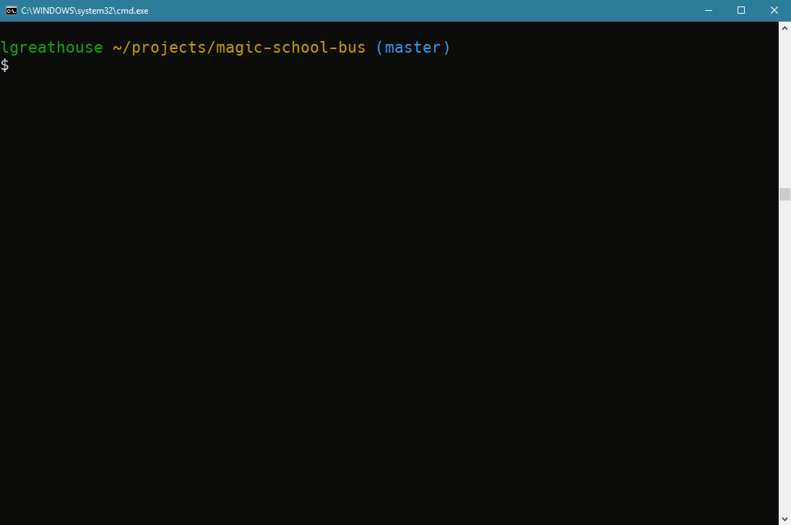

# Magic School Bus

> Seatbelts, everyone!

Magic School Bus is a terminal UI filesystem browser with Vi-inspired keybindings.

It's an early work in progress, but runs on Windows, MacOS, and Linux!

## Installation
Magic School Bus needs **Rust Beta 1.31** or newer to build since it uses features from the upcoming Rust 2018 Edition. That'll change when the edition reaches stable at the beginning of **December, 2018**!

If you already have Rustup installed, you can grab Magic School Bus with:

```sh
rustup install beta
cargo +beta install magic-school-bus
```

## Usage
To start up Magic School Bus, just run:

```sh
# Start in the current directory
msb

# You can also pass a directory to start in
msb ../some-directory
```

This will start you on an educational adventure in your current directory:



For detailed information on all options and flags, run:

```sh
msb --help
```

To navigate between entries, press `j` and `k`.

Press `<return>` to select an entry: if it's a folder, you'll enter it, if it's a file, it'll be opened using your operating system's preferences.

Press `q` to quit.

### Changing shell working directory
Magic School Bus has a special mode intended to help move your shell to the location you navigated to when you exit!

Passing `--pwd` will cause the last working directory to be printed to stderr. You can set up an alias or function to capture stderr and `cd` to it if `msb` exited successfully!

The function I have configured in my `.profile` for Bash is:

```bash
brw() {
	{ error=$(msb --pwd "$@" 2>&1 1>&$out); } {out}>&1

	if [ "$?" -eq 0 ]
	then
		cd "$error"
	fi
}
```

I can type `brw` anywhere to be dropped into a filesystem explorer, navigate around, and when I pop out, I'll be in the right spot!

## License
This project is available under the MIT license. Details are available in [LICENSE.txt](LICENSE.txt).